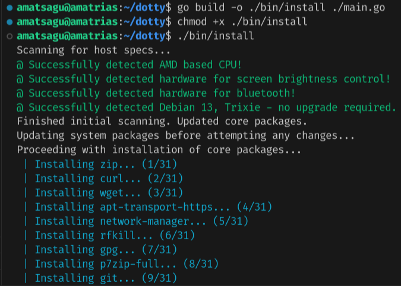

<h2 align=center>Amatsagu Dotfiles<br>✦ Five-tailed ✦</h2>

<div align="center">
<a href="#gallery">Gallery</a> - <a href="#install">Install</a> - <a href="#first-entry">First entry</a> - <a href="#usage">Usage</a> - <a href="#faq">FAQ</a> - <a href="#credit">Credit</a>
<br>
┗━ <a href="https://www.reddit.com/r/unixporn/comments/1d9r6a8/sway_like_falling_petals_and_flowing_water/">See OG reddit thread</a> ━┛
</div>

<h1></h1>

- Linux distro - **Debian 13/Trixie**
- Tiling manager - **Sway**
- GTK theme - **Fluent (yellow, dark)**
- Icon theme - **Papirus (dark)**
- Cursor theme - **Phinger cursors (dark)**
- Terminal color theme - **Gnome shell**
- Fonts - **Noto Sans, Awesome Fonts, FiraCode**
- Terminal - **Foot**
- Text editor - **VSCode, Nano**
- File manager - **Thunar** (with GVFS & Archive Manager)
- Status bar - **Waybar**
- App menu - **Fuzzel**
- Notifications - **Mako**
- Session control - **Wlogout** (with ImageMagick blur script)
- Audio server - **Pipewire**
- Bluetooth manager - **Blueman**
- Connection manager - **Network manager**

## Gallery

<br><br>

<br><br>

<br><br>

## Install

### For Debian 12/13
1. There's app/script prepared to help you quickly setup base desktop. Start by installing minimal version of debian from ISO (without DE), after first login type:
```sh
sudo apt install git
git clone https://github.com/amatsagu/dotfiles.git
cd ./dotfiles
./bin/install
```
2. Restart machine (highly recommended)

> [!CAUTION] 
> Download this script on a directory where you have write permissions. ie. HOME. Or any directory within your home directory (otherwise script will fail). Additionally - if it detects Debian 12 (Bookworm), it'll attempt upgrade to Debian 13 (Trixie). It remains highly stable as all debian packages are thoroughly tested (unlikely on arch based systems) before being accepted. We do this to obtain all the new libraries and Sway which comes with a lot of bufixes and optimization for NVidia and AMD. Edit source code & recompile or follow below steps for other distros if you must stay on outdated Debian 12.

<br><br>

<br><br>

### For other distros
1. Get repo: `git clone https://github.com/amatsagu/dotfiles.git && cd ./dotfiles`
2. Install all packages listed in `pkg/core.go`, `pkg/sway.go` & `pkg/theme.go`
3. Run scripts in order: `script/cursor.sh`, `script/gtk-theme.sh`, `script/papirus-folders.sh`, `script/gsettings.sh` & `script/clone-configs.sh`
4. Restart machine (highly recommended)

## First entry
Type `sway` into any tty to start Sway session. Default configuration is tailored for my laptop so you'll need to edit `~/.config/sway` configs to at least change keyboard layout and screen scalling. If you dislike starting sway from tty, you can install login manager or add below code at bottom of `~/.profile` for auto-start:
```sh
if [ -z "$WAYLAND_DISPLAY" ] && [ -n "$XDG_VTNR" ] && [ "$XDG_VTNR" -eq 1 ] ; then
    exec sway
fi
```

## Usage

### Keybinds
Check sway documentation, all keybinds are set to default. By default, Mod key is Windows/Copilot logo [Mod4].

### Session control (wlogout)
You can click golden gate icon in top left corner on waybar or press `Mod + Shift + E` keys.

## Frequently asked questions
1. Why Sway over Hyprland?
> Stability. Hyprland sadly introduces a lot of regressions between updates and even in general just doesn't work very well outside arch based distros due to their bleeding edge nature. Yes - it is possible to run Hyprland on Debian 13 (Trixie) but is it worth it? For what? Animations? Those dotfiles are meant to be for more work oriented setups where many of us will end up disabling annoying animations anyway.

2. Why Debian?
> Reliability. I'll admire current Debian 12 is sometimes too old so script will attempt auto upgrade to Debian 13 Trixie, testing branch. While they have "testing" in name - all packages are fairly well tested before being allowed. In my experience it's far more reliable than any Arch based distro while we still can enjoy almost latest packages.

3. What's wrong with default settings?
> At first launch, you'll find Sway using polish keyboard and 125% screen scalling. Those are my settings for Thinkpad P14s (gen 2 AMD) laptop with 14'' physical screen. Check higher `#First entry` section to adjust preferences.

4. What about gaming?
> Install `gamemode` and `xwayland` packages, then restart machine. Proton still relies on x-server and gamemode should help you start your favorite games in optimized settings.

5. XYZ app doesn't work?
> Most likely it tries to launch on x-server (which will fail without xwayland package). You can install `xwaland` package, reboot and try then or add flag at start command to force wayland render type. A lot of electron based apps are known to ignore wayland until you enable ozone layer via flag. It's not Sway or Debian problem. By default - all apps I use works with pure wayland - that's the reason why xwayland pkg is opt-in.

6. NVidia?
> Untested. I assume you'll need Debian 13 to have newer kernel and then change/add kernel params to make it work. Sway has about same compatibility as Hyprland regarding that.

## Credit
- Wallpaper created by [ao~](https://www.pixiv.net/en/artworks/123675620)
