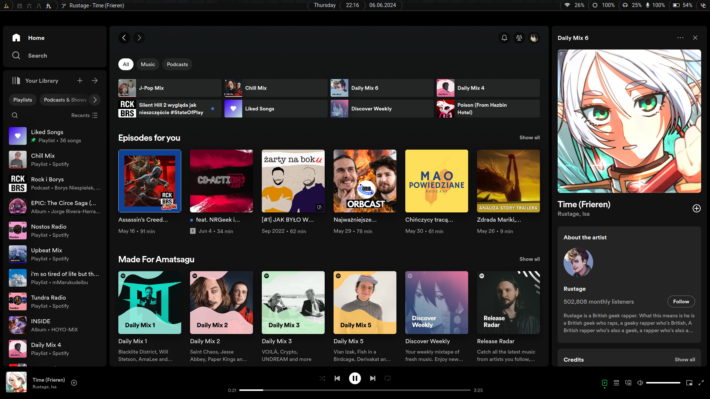

<h1 align=center>Amatsagu Dotfiles</h1>

<a href="#gallery">Gallery</a> - <a href="#install">Install</a> - <a href="#usage">Usage</a> - <a href="#credit">Credit</a>
 
┗━ <a href="https://www.reddit.com/r/unixporn/comments/1d9r6a8/sway_like_falling_petals_and_flowing_water/">See reddit thread</a> ━┛

<h1></h1>

- Linux distro - **Debian 12**
- Tiling manager - **Sway**
- GTK theme - **Adwaita (dark)**
- Icon theme - **Papirus (dark)**
- Cursor theme - **Phinger cursors (dark)**
- Color theme - **Gnome shell**
- Fonts - **Noto Sans, Awesome Fonts, Roboto, FiraCode**
- Terminal - **Foot**
- Text editor - **Nano**
- File manager - **Nemo**
- Status bar - **Waybar**
- App menu - **Fuzzel**
- Notifications - **Mako**
- Session control - **Wlogout**
- Audio server - **Pipewire** + **Pavucontrol**
- Bluetooth manager - **Blueman**
- Connection manager - **Network manager**

## Gallery

  

  

  

  

## Install
