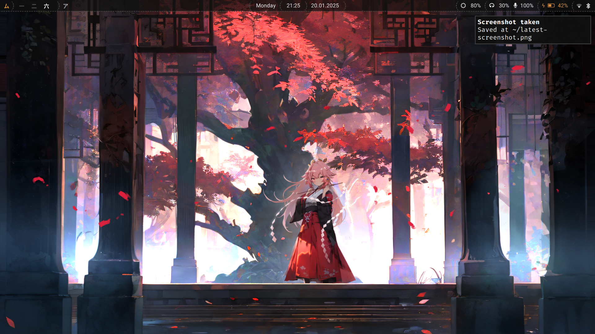
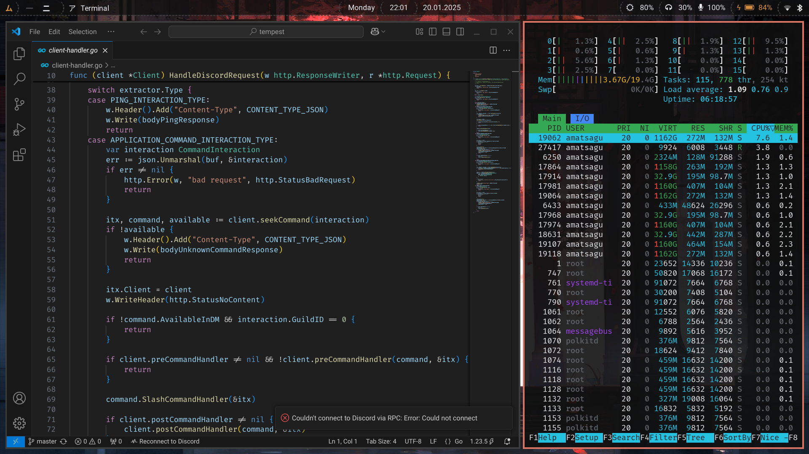
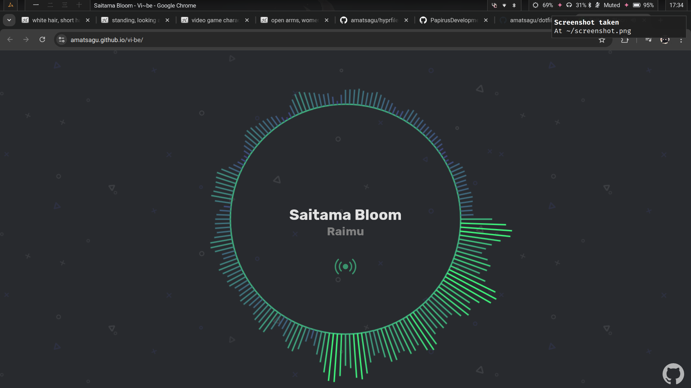
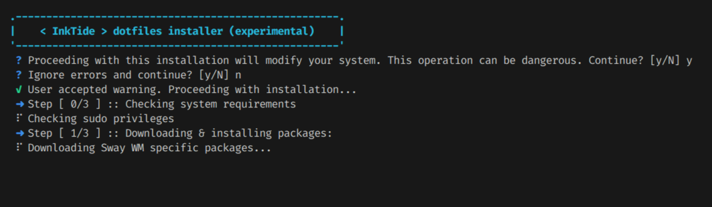

<h2 align=center>Amatsagu Dotfiles<br>✦ InkTide ✦</h2>

<div align="center">
<a href="#gallery">Gallery</a> - <a href="#features">Features</a> - <a href="#install">Install</a> - <a href="#usage">Usage</a> - <a href="#credit">Credit</a>
<br>
┗━ <a href="https://www.reddit.com/r/unixporn/comments/1d9r6a8/sway_like_falling_petals_and_flowing_water/">See OG reddit thread</a> ━┛
</div>

<h1></h1>

- Linux distro - **Any Arch-based** (tested on CachyOS)
- Tiling manager - **Sway v1.12+** (with experimental EDID detection support)
- GTK theme - **Fluent (dark gray)**
- QT5/QT6 theme - **Fluent (Kvantum)**
- Icon theme - **Papirus (dark)**
- Cursor theme - **Phinger cursors (dark)**
- Colors - **Partially Dynamic (via Matugen)**
- Fonts - **Noto Sans, Hack, Fira Code, Windows 11 Fonts, Nerd Fonts, CJK**
- Terminal - **Foot**
- Text editor - **VSCodium, Nano**
- File manager - **Thunar** (with GVFS & Archive Manager)
- Status bar - **Waybar** (with power support: TLP + TLP-PD)
- App menu - **Fuzzel**
- Notifications - **Mako**
- Session control - **Wlogout**
- Session lock - **GTKlock**
- Audio server - **Pipewire**
- Bluetooth manager - **Blueman**
- Connection manager - **Network manager**
- XDG desktop portals - **WLR, GTK, XAPP**
- Password vault manager - **Gnome keyring, Seahorse**

## Gallery

<br><br>

<br><br>

<br><br>

## Install

> [!WARNING]
> This configuration is made by myself, for myself. While the installer now supports general Arch-based systems, it is still experimental.

### For Arch-based Distros (CachyOS, EndeavourOS, etc.)
1. Install a minimal version of your distro with no desktop. **It is highly recommended to use CachyOS** as it provides the optimized kernel and repository structure this was built for. Ensure you have the following services installed and enabled:
    - **Networking**: `networkmanager` (Systemd service: `NetworkManager.service`)
    - **Bluetooth**: `bluez`, `bluez-utils` (Systemd service: `bluetooth.service`)
    - **Audio**: `pipewire`, `wireplumber`, `pipewire-pulse` (+ libs to support specific audio profiles, etc.)

Login to TTY and run:
```sh
sudo pacman -Syu git
git clone https://github.com/amatsagu/dotfiles.git
cd ./dotfiles
./scripts/install.sh
```


2. Restart machine (highly recommended)

> [!CAUTION] 
> Download this script on a directory where you have write permissions. ie. HOME. Or any directory within your home directory (otherwise script will fail). Due to how some apps and scripts are made - part of them are global and other local, so make sure to run it from user account you wish to use.

## Usage

### Keybinds
- **Mod key**: Windows/Super logo [Mod4].
- **Terminal**: `Mod + Enter`
- **Launcher**: `Mod + D`
- **File Manager**: `Mod + B`
- **Change Wallpaper**: `Mod + Shift + W` (Triggers Matugen color update)
- **Session Control**: `Mod + Shift + E`
- **Lock Screen**: `Mod + L`

### Power Profiles
Click the power icon (next to battery status) on the Waybar to cycle between Performance, Balanced, and Power Saver modes.

## Credit
- For backgrounds, check `./wallpapers/credits.txt`