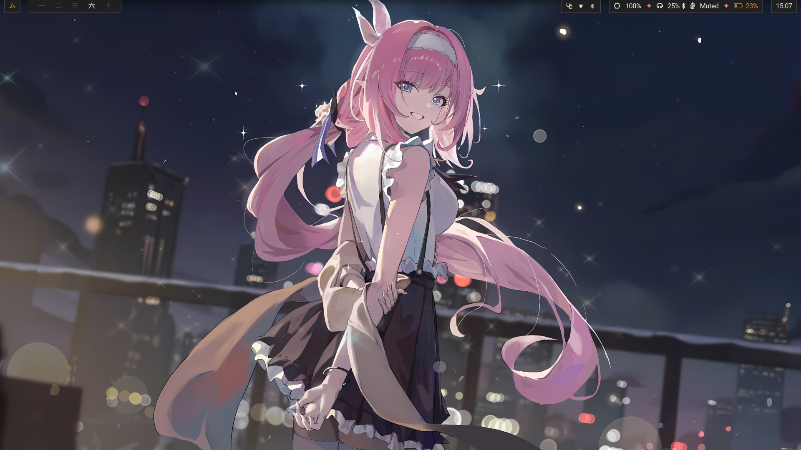

<h2 align=center>Amatsagu Dotfiles<br>✦ InkTide ✦</h2>

<div align="center">
<a href="#gallery">Gallery</a> - <a href="#install">Install</a> - <a href="#usage">Usage</a> - <a href="#credit">Credit</a>
<br>
┗━ <a href="https://www.reddit.com/r/unixporn/comments/1d9r6a8/sway_like_falling_petals_and_flowing_water/">See OG reddit thread</a> ━┛
</div>

<h1></h1>

- Linux distro - **CachyOS**
- Tiling manager - **Sway**
- GTK theme - **Fluent (gray, dark)**
- Icon theme - **Papirus (magenta, dark)**
- Cursor theme - **Phinger cursors (dark)**
- Terminal color theme - **Gnome shell**
- Fonts - **Noto Sans, Awesome Fonts, Fira Code, Roboto**
- Terminal - **Foot**
- Text editor - **VSCode, Nano**
- File manager - **Thunar** (with GVFS & Archive Manager)
- Status bar - **Waybar**
- App menu - **Fuzzel**
- Notifications - **Mako**
- Session control - **Wlogout**
- Session lock - **GTKlock**
- Audio server - **Pipewire**
- Bluetooth manager - **Blueman**
- Connection manager - **Network manager**

## Gallery

<br><br>

<br><br>

<br><br>

## Install

> [!WARNING]
> This configuration is made by myself, for myself, and with very little concern for other's preferences. This configuration is not meant to be "good", it's just meant to be comfortable for me. You'll need some knowledge to tweak sway or waybar configs to match your preferences.

### For CachyOS / Arch based (uses pacman and paru)
1. Install minimal version of CachyOS/Arch with no desktop and minimal amount of packages to get support for audio, bluetooth, network, etc. Then login to tty and paste:
```sh
sudo pacman -Syu git
git clone https://github.com/amatsagu/dotfiles.git
cd ./dotfiles
./scripts/install.sh
```


2. Restart machine (highly recommended)

> [!CAUTION] 
> Download this script on a directory where you have write permissions. ie. HOME. Or any directory within your home directory (otherwise script will fail). Due to how some apps and scripts are made - part of them are global and other local, so make sure to run it from user account you wish to use.

## Usage

### Keybinds
Check sway documentation, all keybinds are set to default. By default, Mod key is Windows/Copilot logo [Mod4].

### Session control (wlogout)
You can click golden gate icon in top left corner on waybar or press `Mod + Shift + E` keys.

### Wallpapers
There's custom script to let you quickly swap wallpapers under `Mod + Shift + W` keys. Script does not edit colors, so it's up to end user to update their sway & waybar configs.

## Credit
- For backgrounds, check `./wallpapers/credits.txt`