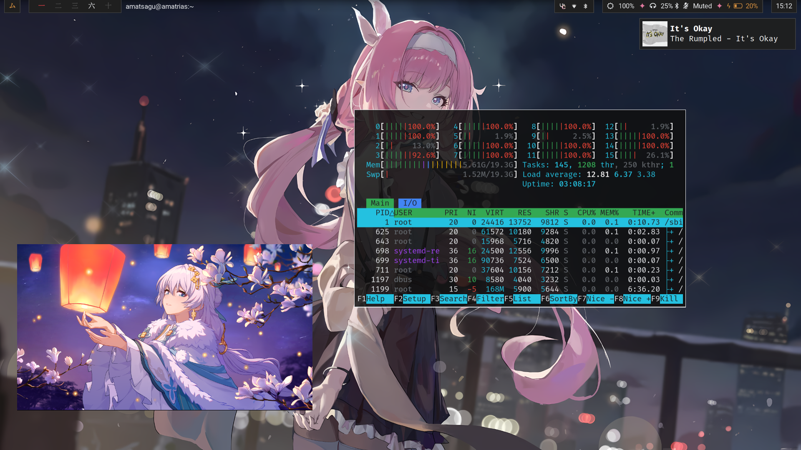

<h1 align=center>Amatsagu Dotfiles</h1>

<div align="center">
<a href="#gallery">Gallery</a> - <a href="#install">Install</a> - <a href="#usage">Usage</a> - <a href="#credit">Credit</a>
<br>
┗━ <a href="https://www.reddit.com/r/unixporn/comments/1d9r6a8/sway_like_falling_petals_and_flowing_water/">See OG reddit thread</a> ━┛
</div>

<h1></h1>

- Linux distro - **Debian 13/Trixie**
- Tiling manager - **Sway**
- GTK theme - **Fluent (yellow, dark)**
- Icon theme - **Papirus (dark)**
- Cursor theme - **Phinger cursors (dark)**
- Terminal color theme - **Gnome shell**
- Fonts - **Noto Sans, Awesome Fonts, FiraCode**
- Terminal - **Foot**
- Text editor - **VSCode, Nano**
- File manager - **Thunar** (with GVFS & Archive Manager)
- Status bar - **Waybar**
- App menu - **Fuzzel**
- Notifications - **Mako**
- Session control - **Wlogout** (with ImageMagick blur script)
- Audio server - **Pipewire**
- Bluetooth manager - **Blueman**
- Connection manager - **Network manager**

## Gallery

<br><br>

<br><br>

<br><br>

## Install

### For Debian 12/13
There's app/script prepared to help you quickly setup base desktop. Start by installing minimal version of debian from ISO (without DE), after first login type:
```sh
sudo apt install git
git clone https://github.com/amatsagu/dotfiles.git
cd ./dotfiles
./bin/install
```
> [!CAUTION] 
> Download this script on a directory where you have write permissions. ie. HOME. Or any directory within your home directory (otherwise script will fail). Additionally - if it detectds Debian 12 (Bookworm), it'll attempt upgrade to Debian 13 (Trixie). It remains highly stable as all debian packages are thoroughly tested (unlikely on arch based systems) before being accepted. We do this to obtain all the new libraries and Sway which comes with a lot of bufixes and optimization for NVidia and AMD. Edit source code & recompile or follow below steps for other distros if you must stay on outdated Debian 12.

### For other distros
1. Get repo: `git clone https://github.com/amatsagu/dotfiles.git && cd ./dotfiles`
2. Install all packages listed in `pkg/core.go`, `pkg/sway.go` & `pkg/theme.go`
3. Run scripts in order: `script/cursor.sh`, `script/gtk-theme.sh`, `script/papirus-folders.sh`, `script/gsettings.sh` & `script/clone-configs.sh`
4. Restart machine (highly recommended)
5. Login into any tty and type `sway` to start session

## First entry
Type `sway` into any tty to start Sway session. Default configuration is tailored for my laptop so you'll need to edit `~/.config/sway` configs to at least change keyboard layout and screen scalling. If you dislike starting sway from tty, you can install login manager or add below code at bottom of `~/.profile` for auto-start:
```sh
if [ -z "$WAYLAND_DISPLAY" ] && [ -n "$XDG_VTNR" ] && [ "$XDG_VTNR" -eq 1 ] ; then
    exec sway
fi
```

## Usage

### Keybinds
Check sway documentation, all keybinds are set to default. By default, Mod key is Windows/Copilot logo [Mod4].

### Session control (wlogout)
You can click golden gate icon in top left corner on waybar or press `Mod + Shift + E` keys.

## Credit
- Wallpaper created by [Re Eʟy (@Elyzerda)](https://x.com/elyzerda/status/1833474305729921168?t=Au0iDGAeCAdQdHbwjKoD_Q)
